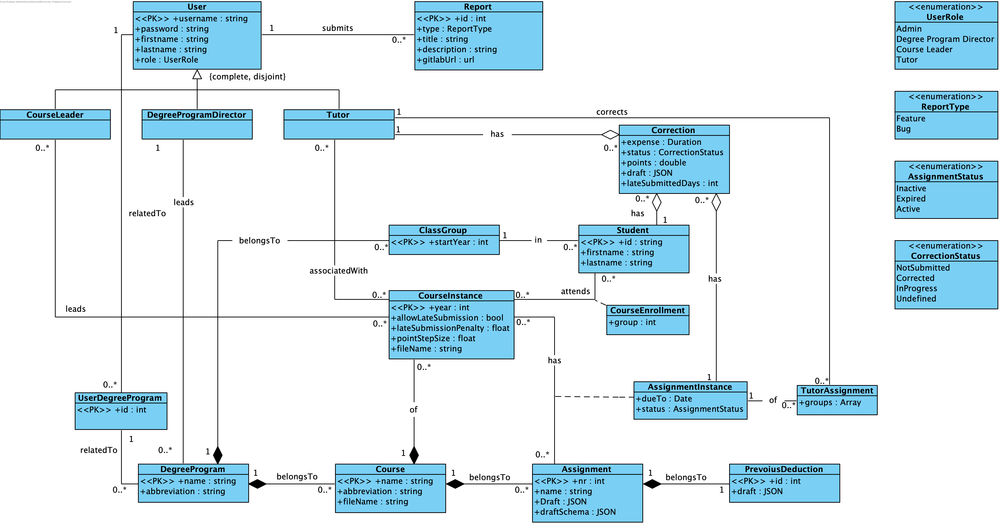

# Getting started with Evaluator

## Table of Contents

* [Dependencies](#dependencies)
  * [Node.js](#nodejs)
  * [Docker Desktop](#docker-desktop)
  * [Python](#python)
* [Clone the Repository](#clone-the-repository)
* [Configuring the Environment](#configuring-the-environment)
* [Database Setup](#database-setup)
* [Backend Setup](#backend-setup)
  * [Django](#django)
  * [JPlag (not necessarily required)](#jplag-not-necessarily-required)
* [Frontend Setup](#frontend-setup)

## Dependencies

There are some programs that are needed before you can start developing. Some IDEs may take care of some of them, so
make sure to check in beforehand.

### Node.js

This is the runtime for JavaScript that is eventually needed for Angular (frontend). You can download it from the 
official website [https://nodejs.org/en/download](https://nodejs.org/en/download).

### Docker Desktop

Both `docker` and `docker-compose` are needed for the database and for building the image. You can download the 
individual applications, but it is recommended to download Docker Desktop, which combines the Docker products. You can
download it from the official website 
[https://www.docker.com/products/docker-desktop/](https://www.docker.com/products/docker-desktop/).

### Python

Python is needed for running Django in the backend. You can download it from the official website 
[https://www.python.org/downloads/](https://www.python.org/downloads/).

## Clone the Repository

Clone the repository from GitHub:

```
git clone https://github.com/maxi-smidt/evaluator.git
```

## Configuring the Environment

Navigate into the root directory of the project. There you need to create a file called `.env`. This is a hidden file
that contains variables that will be consumed by the backend and the frontend and should not be published or are
depending on the environment. If you want to learn more about these files, have a look here 
[https://dotenvx.com/docs/env-file](https://dotenvx.com/docs/env-file). Now, put all the following variables as well as
the according values (these are just the development values) in there.

| Variable                 | Value                                                        | Description                                   | Category |
|--------------------------|--------------------------------------------------------------|-----------------------------------------------|----------|
| `BUILD_MODE`             | `development`                                                | sets the configuration for the frontend build | frontend |
| `PG_PATH`                | `path/on/your/computer`*                                     | path to your local postgres data mount        | database |
| `PG_DB`                  | `postgres`                                                   | name of the database                          | database |
| `PG_DB_USER`             | `postgres`                                                   | user of the database                          | database |
| `PG_DB_PW`               | `password`                                                   | password of the database                      | database |
| `PG_HOST`                | `localhost`                                                  | host of the database                          | database |
| `PG_PORT`                | `5432`                                                       | port of the database                          | database |
| `SECRET_KEY`             | **                                                           | secret key that Django uses for hashing       | backend  |
| `DEBUG`                  | `True`                                                       | if set to `True` debug information is printed | backend  |
| `DJANGO_SETTINGS_MODULE` | `backend.settings`                                           | Django settings module                        | backend  |
| `CORS_ALLOWED_ORIGINS`   | `http://localhost:80,http://localhost,http://localhost:4200` | request origins Django allows to receive      | backend  |
| `ALLOWED_HOSTS`          | `localhost`                                                  | allowed destination domains                   | backend  |

\* you could also specify just one word – this would be a named volume. Then you would have to add 
```
volumes:
  evaluator-postgres:
```
on the very bottom of the `docker-compose.yml`.

\** to generate the secret key, you can use the website [https://djecrety.ir](https://djecrety.ir) 

## Database Setup

First, start the Docker Daemon by starting Docker Desktop. In your terminal switch to the root directory of the project
and run 
```
docker compose up db
```
this starts only the database service on your device. On IDEs like PyCharm, you can alternatively open the 
`docker-compose.yml` and click on the green start button next to the `db` service (**recommended**). If you ran this
once, you can start it the next time using Docker Desktop or PyCharm services.

If you did this for the first time, or the database schema was changed on your branch or the master branch, you should
run the following commands in your backend directory:

```
python manage.py migrate  # migrates the database schema (use this for the first time)
python manage.py clear_db # clears all the data and drops the database (use this if you want to clear/delete the database)
python manage.py reset_db # applies clear_db, migrate and seed_db (use this if you want to reset the data)
python manage.py seed_db  # fills the database with generated data (use this if you want to fille your empty tables with data)
```

**The current schema of the database:**



## Backend Setup

### Django

After you have started the database, you can proceed with this step, otherwise the connection will fail. Navigate to the
`backend` directory and install all the packages:
```
pip install -r requirements.txt
```

The database is ready to get filled now. Therefore, run the script for reseting and seeding:
```
python manage.py rebuild_db
```

This will create the following users that you can use to log in:

| Username       | Password       | Type                      |
|----------------|----------------|---------------------------|
| `evaluator-su` | `password`     | `ADMIN`                   |
| `P00000`       | `password`     | `DEGREE_PROGRAM_DIRECTOR` |
| `P00001`       | `password`     | `COURSE_LEADER`           |
| `P00002`       | `password`     | `COURSE_LEADER`           |
| `S0000000001`  | `password`     | `TUTOR`                   |
| `S0000000002`  | `password`     | `TUTOR`                   |
| `S0000000003`  | `password`     | `TUTOR`                   |


Now, the Django server can be started by:
```
python manage.py runserver
```

Or alternatively, you can create a run configuration (**recommended**):


### JPlag (not necessarily required)

You only need this step if you want to use/develop the JPlag plagiarism scanner. This project is developed in this
[GitHub repository](https://github.com/maxi-smidt/evaluator-jplag). The Docker image is always automatically pushed to
DockerHub, and therefore the setup process is similar to the database. You need to run 
```
docker compose up jplag
```


## Frontend Setup

To set up the frontend, you need to navigate into the `frontend` directory and run
```
npm install
```
this will install all the necessary packages. To start the application run
```
npm run start
```
It is **recommended** to add a run configuration here as well:
